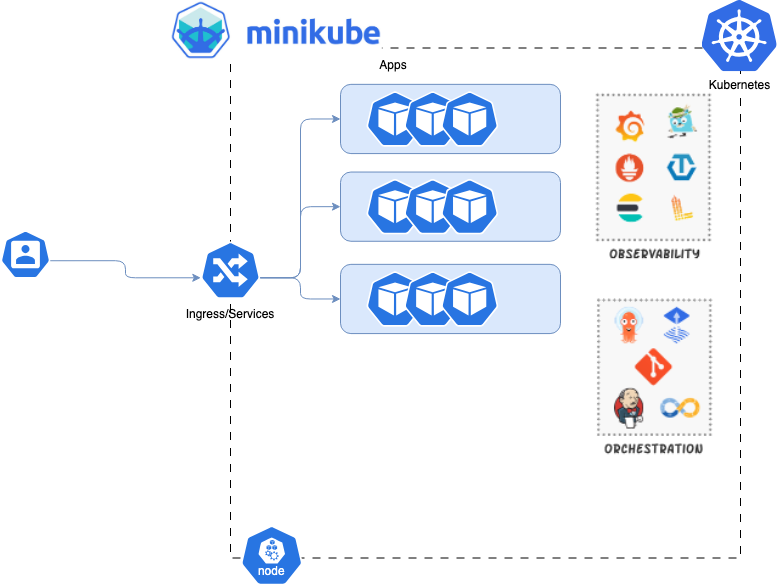

# Minikube with monitoring enabled



## Kubernetes (for MAC)

> [!NOTE]
> This is pure Mac OS installation. Please comment if you would like to have docs for another OS (Win,Linux)

1) The easiest way to run containers on Mac is to use [**Colima**](https://github.com/abiosoft/colima) 
    ```
    brew install colima
    ```
    Then just start your runtime
    ```
    colima start
    ```

2) So now we can install and start our kubernetes cluster. The easiest way is to use **minikube**

    ```
    brew install minikube
    ```
    Start the cluster
    ```
    minikube start
    ```

## Let's play with it ###

1)  I would suggest to create an alias for kubectl.
    In case of using zsh as a shell, add alias into zshrc :
    ```
    cat ~/.zshrc >> alias k=kubectl
    ```
2) Now we can start our "k" commands:
    ```
    k get nodes
    ``` 
    show us that minikube is ready and running
    ```
    k get pods -A
    ```
    shows all pods in all namespaces. For now we should see only system related pods running in kube-system namespace
3) Let's add some apps
    ```
    k create deployment nginx-hello-text --image=nginxdemos/hello:plain-text
    ```
    This is very small nginx that just getting back with text hello output
    ```
    k expose deployment nginx-hello-text --type=NodePort --port=80
    ```
    Create a service that can be used as a load-balancer
    ```
    k scale deploy nginx-hello-text --replicas=3
    ```
    Scale nginx deployment to 3 pods
    ```
    k get endpoints nginx-hello-text
    ```
    Be sure that our service is referring to all three pods
    ```
    minikube service nginx-hello-text
    ```
    Now creating a port-forwarding so we can access the service. Copy URL with the loopback IP and newly created port.
    Now you can either use browser or CURL.
    ```
    ·> curl 127.0.0.1:65081
    Server address: 10.244.0.90:80
    Server name: nginx-hello-text-549879f679-bg6nm
    Date: 14/Mar/2024:11:43:02 +0000
    URI: /
    Request ID: 9478d659ec0050dc62bfb61e895a6723
    ```
    If you're using CURL you can see that server address is changing all the time because there is no caching with CURL so load-balancing just works

    **(Optional)** You can also use LoadBalancer instead of NodePort but you will need to use sudo for that.
    ```
    ...
    k expose deployment nginx-hello-text --type=NodePort --port=80
    ...
    minikube tunnel
    ```
## Now adding monitoring

### Prometheus

1) Add prometheus repository

    ```
    helm repo add prometheus-community https://prometheus-community.github.io/helm-charts
    ```

2) Install provided Helm chart for Prometheus
    ```
    helm install prometheus prometheus-community/prometheus
    ```
3) Expose the prometheus-server service via NodePort
    ```
    k expose service prometheus-server --type=NodePort --target-port=9090 --name=prometheus-server-np
    ```
4) Check services:
    ```
    k get svc
    ```

### Access Prometheus UI

1) Expose service URL:
    ```
    minikube service prometheus-server-np --url
    ```
2) Prometheus UI:
    
3) Using Prometheus UI:
    Consider using [Prometheus Docs] (prometheus.io/docs/prometheus/latest/querying/basics/) for more information on how to use PromQL 
    

### Grafana

1) Installation. Add Grafana Helm repo:
    ```
    helm repo add grafana https://grafana.github.io/helm-charts
    ```
2) Install Grafana chart:
    ```
    helm install grafana grafana/grafana
    ```
3) Expose Grafana service via NodePort in order to access Grafana UI:
    ```
    k expose service grafana --type=NodePort --target-port=3000 --name=grafana-np
    ```
4) Check exposed service:
    ```
    k get services
    ```
5) Get Grafana admin credentials
    ```
    k get secret --namespace default grafana -o jsonpath="{.data.admin-password}" | base64 --decode ; echo
    ```
6) Access Grafana Web UI
    ```
    minikube service grafana-np
    ```
7) Add Prometheus data source (use prometheus-server:80 URL):
    
8) Import community based Grafana dashboards. For example you can use dashboard with 6417 id: 
    
9) Using Dashboard to monitor our Kubernetes:
    


# AWS EKS with monitoring enabled

## EKS with terraform

> [!NOTE]
> This is AWS EKS terraform installation by using standard Hashicorp Terraform script to run EKS. 
> It creates NEW VPC in separate region,subnets,security groups,EC2 instances as kubernetes nodes,ARNs and other dependencies.
> Please clone the repo and update the script and variables accordingly if you want it to use your current infrastructure. 

1) Install terraform.
    If you are new to Terraform, please check official [**docs**](https://developer.hashicorp.com/terraform/tutorials/aws-get-started/install-cli) on how to install and run terraform.
> [!NOTE]
> If you're using git for this clone, do not forget to put terraform operational files to .gitignore. Otherwise you could have issues with commiting huge files to the git.
> Check the example of terraform gitignore [**here**](https://github.com/github/gitignore/blob/main/Terraform.gitignore) 

2) Install AWS CLI.
    If you are new to AWS CLI, please check official [**docs**](https://docs.aws.amazon.com/cli/latest/userguide/getting-started-install.html) on how to install it on your system.
    On Mac the best way is to use brew for that
    ```
    brew install aws
    ```
    Next, is to configure aws and enter your aws credentials
    Example:
    ```
    aws configure
    AWS Access Key ID [********************]:
    AWS Secret Access Key [**********************]:
    Default region name [us-east-1]:
    Default output format [json]:
    ```
    If you do not have your credentials ready, you will need to configure those through the [**AWS Console with IAM**](https://docs.aws.amazon.com/cli/latest/userguide/cli-chap-authentication.html)

    To be sure that everything configured correctly, run those command and double-check the output:
    ```
    cat ~/.aws/config
    ```
    ```
    cat ~/.aws/credentials
    ```

3) Run terraform scripts (assuming repo is copied)
    ```
    cd terraform-provision-eks-cluster
    terraform init
    terraform plan
    terraform apply -auto-approve
    ```
    If no errors, to could take 10-15min to complete 

4) Terraform will put output values from the installation according output.tf
    Now we can grab it from there and update our kubeconfig.
    Run the following command to retrieve the access credentials for your cluster and configure kubectl
    ```
    aws eks --region $(terraform output -raw region) update-kubeconfig \
    --name $(terraform output -raw cluster_name)

    ```
    Now we have our local kube-config updated and let's check which kube-config is currently active:
    ```
    k config current-context
    ```
    It should start from arn:aws:eks:*your-config*

> [!NOTE]
> No worries if you have another kube-config (context) already in place.
> You can switch between contexts at any time
> ```
> kubectl config use-context *your-context*
> ```
>Also you can check all contexts by running command:
>```
>kubectl config get-context
>kubectl config get-cluster
>```
>Remember, if you run terraform couple of times you can find that it creates new context all the time.
>You may want to delete old context by running the command:
>```
>kubectl config delete-context *your-cluster*
>kubectl config delete-cluster *your-cluster*

5) Congrats, your cluster in EKS is live and running. Check that kube-system namespace has system pods in place:
    ```
    kubectl get pods -A
    ```

6) You can now go ahead and run all supportive deployments as we did with the local cluster:
   - [nginx-hello](#lets-play-with-it)
   - [prometheus](#prometheus)
   - [grafana](#grafana)

> [!NOTE]
> Keep in mins that EKS deployment difference in the way that you would need to create a service with --type=LoadBalancer
> And having specific annotations for eks lb as it is written [**here**](https://docs.aws.amazon.com/eks/latest/userguide/network-load-balancing.html)
> Example of such service as LoadBalancer you can find in this repo: [link](terraform-provision-eks-cluster/service-nginx-hello-text.yaml)
